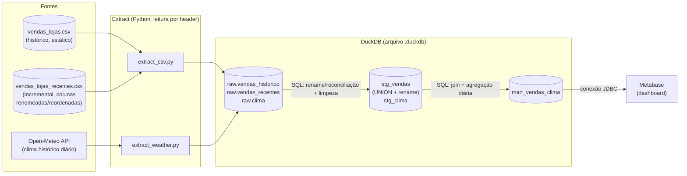

# Workshop: Construindo um Pipeline de Dados — da Ingestão à Análise

**Evento:** Semana Acadêmica de Ciência da Computação — PUC-SP (PUCTech)
**Data/Horário:** 06/10/2026, 13:30–15:30 (120 min, presencial)
**Instrutor:** Daniel (Analytics Engineer, DoorDash)
**Público:** Alunos de graduação em Ciência da Computação, nível iniciante/intermediário em dados

Status: **DRAFT — aguardando aprovação antes de implementar/publicar no GitHub.**

---

## 1. Objetivo do workshop

Ao final das 2 horas, o aluno deve ter construído — com as próprias mãos — um pipeline de dados completo e rodando localmente:

1. **Extração** de dado estático (arquivo CSV, simulando um sistema legado/export de ERP)
2. **Extração** de dado dinâmico via **API pública** (Open-Meteo)
3. **Carga** dos dados brutos em um **DuckDB** (camada *raw*)
4. **Transformação/modelagem** em SQL dentro do DuckDB (camadas *staging* → *marts*, estilo medallion simplificado)
5. **Análise/visualização** dos dados modelados em um **dashboard no Metabase**

A ideia pedagógica é que o aluno *veja o dado se transformar*, etapa por etapa — do CSV bagunçado e do JSON da API até um dashboard que responde uma pergunta de negócio real.

Além disso, para deixar a extração de arquivos mais próxima da realidade, o pipeline vai lidar com duas cargas do mesmo tipo de dado (vendas): uma carga histórica e uma carga incremental que chega com nomenclatura e ordem de colunas diferentes — simulando uma mudança no sistema de origem (*schema drift*). Isso reforça, na prática, por que extrair por **nome de coluna (header)** é mais robusto do que extrair por **posição**.

### Não-objetivos (para não estourar o tempo)
- Orquestração (Airflow/Dagster) — mencionar de passagem, não implementar
- Cloud/infra — tudo roda localmente (laptop do aluno)
- Testes de dados avançados (dbt, Great Expectations) — citar como próximo passo

---

## 2. Narrativa do workshop (o "case")

Empresa fictícia: **GeloDados** — uma rede de 5 lojas de sorvete/bebida gelada em capitais brasileiras.

- O time comercial exporta as vendas diárias do sistema de ponto de venda como **CSV** (dado estático, "sujo", já existente).
- Ninguém na empresa sabe dizer se o **clima** influencia as vendas — essa informação não existe internamente, precisa vir de uma **API externa** (Open-Meteo).
- Missão do aluno: construir o pipeline que junta os dois mundos e responde: *"Vendemos mais quando está mais quente? Em qual loja o efeito é mais forte?"*

Essa pergunta de negócio é o fio condutor de todas as etapas — cada camada do pipeline existe para aproximar a resposta.

---

## 3. Arquitetura



Camadas dentro do DuckDB (medallion simplificado):
- **raw** — dado bruto, sem transformação, tipado o mínimo possível (espelha a fonte)
- **staging (stg_)** — limpeza, renomeação de colunas, tipagem correta, deduplicação
- **mart** — dado modelado e agregado, pronto para consumo analítico (o que o Metabase vai ler)

---

## 4. Stack e por quê

| Ferramenta | Papel | Por que essa escolha para um workshop |
|---|---|---|
| **Python 3.11+** | Extração (E) | Linguagem que a maioria já conhece; `requests` + `pandas`/`csv` é suficiente, sem framework pesado |
| **DuckDB** | Banco analítico (L + T) | Zero setup (arquivo local, sem servidor), SQL padrão, rápido, roda embutido no processo Python — ideal para laptop de aluno sem instalar Postgres/Docker de banco |
| **Metabase** | BI / Dashboard (visualização) | Open source, conecta nativamente em DuckDB (via driver JDBC), interface visual amigável para quem nunca fez dashboard |
| **Docker** (só para o Metabase) | Ambiente isolado | Evita "não funciona na minha máquina" — só precisa do Docker Desktop instalado antes |

Todo o resto (extração, transformação) roda em Python puro + DuckDB embutido, sem Docker — minimiza dependência de infra no dia do evento.

---

## 5. Fontes de dados

### 5.1 Dado estático — vendas (mockado), grão de transação

Simulamos um export de sistema de vendas no grão de **transação individual** (1 linha = 1 cliente comprando 1 item em 1 loja em 1 momento) — não um agregado diário. Isso é mais realista e obriga o pipeline a agregar por dia/loja na camada de mart antes de juntar com o clima (que é diário), exatamente o tipo de ajuste de grão que um analytics engineer faz no dia a dia.

Vamos gerar os CSVs nós mesmos (script `generate_mock_csv.py`) para garantir:
- Volume adequado para laptop de aluno: ~5 lojas × ~87 dias × ~8-12 transações/loja/dia ≈ 4.000-5.000 linhas no arquivo histórico
- "Sujeira" proposital para ensinar limpeza de dados: alguns valores nulos, formatos de data inconsistentes em algumas linhas, duplicatas, um outlier de venda

**Dimensões incluídas na tabela de vendas (arquivo único, denormalizado — como um export real de POS costuma vir):**

| coluna | tipo | exemplo | observação |
|---|---|---|---|
| `data_venda` | string | `2026-06-01` (maioria) / `01/06/2026` (algumas linhas) | inconsistência proposital |
| `loja_id` | string | `LJ01` | |
| `cidade` | string | `Sao Paulo` | usada para o join com o clima |
| `cliente_id` | string | `CLI00423` | permite análises por cliente (recorrência, ticket médio) |
| `nome_cliente` | string | `Fernanda Souza` | dado dimensional "de negócio" |
| `idade_cliente` | int | `27` | dimensão extra para segmentação |
| `genero_cliente` | string | `F`, `M`, `Outro` | dimensão extra para segmentação |
| `produto` | string | `Picole`, `Sorvete Pote`, `Milkshake`, `Agua de Coco` | categoria do item |
| `sabor` | string | `Chocolate`, `Morango`, `Baunilha`, `Coco`, `Limao` | dimensão do item vendido |
| `unidades_vendidas` | int | `3` | agora por transação, não agregado |
| `preco_unitario` | float | `8.90` | |
| `receita_brl` | float | `26.70` | `unidades_vendidas * preco_unitario` |
| `forma_pagamento` | string | `pix`, `cartao`, `dinheiro` | |

Cidades escolhidas (para casar com a API de clima): **São Paulo, Rio de Janeiro, Curitiba, Fortaleza, Porto Alegre** — cobrem climas bem diferentes (litoral quente, sul frio), o que torna o gráfico final mais interessante.

Com cliente e sabor como dimensões, dá para explorar depois (stretch goals): ticket médio por cliente, sabor mais vendido por faixa de temperatura, recorrência de cliente por loja, etc.

### 5.1.b Carga incremental com *schema drift* — `vendas_lojas_recentes.csv`

Um segundo CSV simula a chegada de **dados mais recentes** (ex.: os últimos 5 dias da janela, que "chegaram depois" da carga histórica) — só que exportados por uma versão nova do sistema de origem, com:
- **Nomes de coluna diferentes** (convenção abreviada, comum em sistemas legados/corporativos): `dt_venda`, `id_loja`, `uf_cidade`, `id_cliente`, `nm_cliente`, `idade`, `genero`, `categoria_produto`, `sabor_item`, `qtd_vendida`, `vl_unitario`, `vl_total`, `tipo_pagamento`
- **Ordem de colunas diferente** da do arquivo histórico

Esse arquivo é o coração de um exercício deliberado sobre **ingestão robusta**:

1. Primeiro mostramos **ao vivo o jeito errado**: um `extract_csv.py` que lê colunas **por posição** (`row[0]`, `row[1]`...) — ao trocar de arquivo, ele carrega dado errado silenciosamente (ex.: nome do cliente caindo na coluna de cidade) porque a ordem mudou.
2. Depois corrigimos: leitura **por nome de coluna** (header) usando `pandas.read_csv`, com os dois arquivos carregados em tabelas `raw` separadas, cada uma espelhando fielmente o schema da sua fonte (`raw.vendas_historico` e `raw.vendas_recentes`, sem renomear nada ainda — raw nunca mente sobre a fonte).
3. A reconciliação de nomenclatura (`dt_venda` → `data_venda`, `id_loja` → `loja_id` etc.) acontece de forma **explícita na camada de staging**, via um dicionário de mapeamento — e as duas fontes viram um único `stg_vendas` via `UNION ALL` após o rename.

Esse é um dos aprendizados mais valiosos do workshop: por que **staging existe** (isolar a lógica de "traduzir" fontes diferentes para um schema canônico) e por que ingestão por posição é uma armadilha clássica em pipelines reais.

### 5.2 Dado dinâmico — Open-Meteo API

- **Sem API key, sem cadastro**, uso não comercial gratuito até 10.000 chamadas/dia (mais que suficiente mesmo com a turma toda rodando ao mesmo tempo na mesma rede).
- Endpoint de **geocoding** (para converter nome da cidade em lat/long):
  `https://geocoding-api.open-meteo.com/v1/search?name=Sao+Paulo&count=1&language=pt&format=json`
- Endpoint de **clima histórico diário**:
  `https://archive-api.open-meteo.com/v1/archive?latitude=-23.55&longitude=-46.63&start_date=2026-06-01&end_date=2026-08-29&daily=temperature_2m_max,temperature_2m_min,precipitation_sum&timezone=America%2FSao_Paulo`

Retorna JSON com séries diárias de temperatura máx/mín e precipitação — exatamente o grão (1 linha por cidade/dia) que precisamos para juntar com `vendas_lojas.csv`.

**Plano de contingência (wifi do campus):** cachear localmente um `weather_snapshot.json` já baixado antes do evento. Se a API cair ou a rede do PUC-SP travar com 40 alunos batendo ao mesmo tempo, o script detecta falha de conexão e faz fallback para o snapshot em disco — ninguém trava a aula por causa de wifi.

---

## 6. Estrutura do repositório (para o GitHub)

```
workshop-pipeline-dados/
├── README.md                      # guia do aluno, passo a passo
├── SETUP.md                       # pré-requisitos e instalação (enviar 2-3 dias antes)
├── requirements.txt                # duckdb, pandas, requests
├── docker-compose.yml              # sobe o Metabase
├── data/
│   ├── raw/
│   │   └── vendas_lojas.csv           # histórico, mock gerado, já commitado (dado determinístico)
│   ├── incoming/
│   │   └── vendas_lojas_recentes.csv  # carga incremental, colunas renomeadas/reordenadas (schema drift)
│   └── cache/
│       └── weather_snapshot.json      # fallback offline
├── scripts/
│   ├── generate_mock_csv.py        # gera o CSV (aluno pode rodar de novo/alterar)
│   ├── extract_csv.py              # lê CSV -> carrega em raw.vendas
│   ├── extract_weather.py          # chama Open-Meteo -> carrega em raw.clima
│   ├── transform.sql               # raw -> staging -> mart (executado via duckdb CLI ou python)
│   └── run_pipeline.py             # orquestra tudo (extract -> load -> transform), 1 comando só
├── notebooks/
│   └── explorar_duckdb.ipynb       # opcional, para quem quiser mexer fora do fluxo principal
├── metabase/
│   └── dashboard_export.json       # dashboard pronto para import (plano B se faltar tempo)
└── slides/
    └── workshop-slides.pdf
```

---

## 7. Roteiro detalhado (120 minutos)

| Horário | Duração | Bloco | Conteúdo |
|---|---|---|---|
| 13:30–13:40 | 10 min | Abertura | Contexto: o que é engenharia de dados, onde ela mora no dia a dia (DoorDash como exemplo real), apresentação do case GeloDados |
| 13:40–13:50 | 10 min | Setup check | Confirmar Python, Docker e clone do repo funcionando em todos os laptops (idealmente pré-checado via SETUP.md antes do dia, aqui é só validação rápida) |
| 13:50–14:10 | 20 min | Extração — arquivos estáticos (histórico + incremental) | Ler `vendas_lojas.csv`, mostrar problemas de qualidade *ao vivo*; carregar `vendas_lojas_recentes.csv` e demonstrar a armadilha da leitura por posição vs. por header (schema drift); carregar ambos crus em `raw.vendas_historico`/`raw.vendas_recentes` |
| 14:10–14:30 | 20 min | Extração — API | Explicar REST/JSON rapidamente, chamar Open-Meteo (geocoding + histórico), carregar em `raw.clima` |
| 14:30–14:55 | 25 min | Transformação (SQL no DuckDB) | Staging: rename/reconciliação das duas fontes de vendas (`UNION ALL`), limpeza de datas, tipos, remoção de duplicata. Mart: agregação diária por loja + join com clima, métricas (receita média por faixa de temperatura, por loja, por sabor) |
| 14:55–15:00 | 5 min | *Intervalo curto* | Respiro antes da parte visual |
| 15:00–15:20 | 20 min | Metabase | Conectar Metabase ao arquivo DuckDB, montar 3 perguntas/gráficos ao vivo, montar 1 dashboard |
| 15:20–15:30 | 10 min | Fechamento | Recap do pipeline ponta a ponta, próximos passos (orquestração, testes, cloud), Q&A |

Esse roteiro é apertado — cada bloco tem uma versão "atalho" pronta (código já escrito, só explicar) caso o tempo aperte, garantindo que todo mundo saia com o dashboard funcionando mesmo que a turma seja mais lenta.

---

## 8. Perguntas/gráficos do dashboard Metabase

1. **Receita total por cidade** (bar chart) — visão geral do negócio
2. **Receita diária vs. temperatura máxima** (scatter ou linha dupla) — a pergunta central do case
3. **Receita média por faixa de temperatura** (ex.: <20°C, 20-28°C, >28°C) por loja — resposta direta e visual à pergunta de negócio
4. *(stretch)* Mix de sabor/produto por faixa de temperatura (ex.: água de coco ou sabores cítricos vendem mais no calor?) — se sobrar tempo
5. *(stretch)* Ticket médio por cliente e por loja — possível graças à dimensão de cliente no dado transacional

---

## 9. Pré-requisitos a enviar aos alunos (antes do dia 06/10)

- Python 3.11+ instalado
- Docker Desktop instalado e rodando
- Git instalado, repositório clonado
- Editor de código (VS Code sugerido)
- Testar `docker compose up` uma vez antes do evento (Metabase demora ~1 min para subir na primeira vez)

Isso vai para `SETUP.md` no repo, e deve ser enviado pela PUCTech com 2-3 dias de antecedência para reduzir tempo perdido com ambiente no dia.

---

## 10. Riscos e mitigação

| Risco | Mitigação |
|---|---|
| Wifi do campus instável/lenta com todos batendo na API | `weather_snapshot.json` em cache local, fallback automático no script |
| Laptops variados (Windows/Mac/Linux, alunos sem Docker antes) | SETUP.md enviado antes; Docker só é necessário para o Metabase, resto é Python puro |
| Tempo apertado (2h é pouco para pipeline completo) | Código de cada etapa já vem pronto/comentado; aluno acompanha e adapta, não escreve do zero |
| Metabase demorar para subir (primeira execução do container) | Subir o `docker compose up` no bloco de "setup check" (13:40), bem antes de precisar dele às 15:00 |
| Aluno sem experiência em SQL | `transform.sql` com comentários linha a linha; foco em ensinar o *porquê* de cada camada, não sintaxe SQL avançada |

---

## 11. Próximos passos (após esta aprovação)

1. Implementar os scripts (`generate_mock_csv.py` — gerando os dois arquivos de vendas, histórico e incremental, com o mapeamento de colunas documentado; `extract_csv.py` com leitura por header; `extract_weather.py`; `transform.sql` com a reconciliação de schema; `run_pipeline.py`)
2. Testar o pipeline ponta a ponta localmente
3. Subir Metabase via Docker, conectar ao DuckDB, montar o dashboard de referência
4. Escrever `README.md` e `SETUP.md` em português, voltados ao aluno
5. Criar o repositório no GitHub e publicar
6. (Opcional) Preparar slides de abertura

---

## Alternativas de API consideradas

- **Banco Central do Brasil — SGS** (`api.bcb.gov.br`): também sem API key, dados de câmbio/Selic/IPCA. Descartada como fonte principal porque tem limite de "últimos N" registros (máx. 20) e janela de consulta de até 10 anos por request — mais rígida para uma demo ao vivo. Fica documentada como sugestão de "vá além" para alunos que quiserem trocar o case por um de fintech/câmbio depois do workshop.
